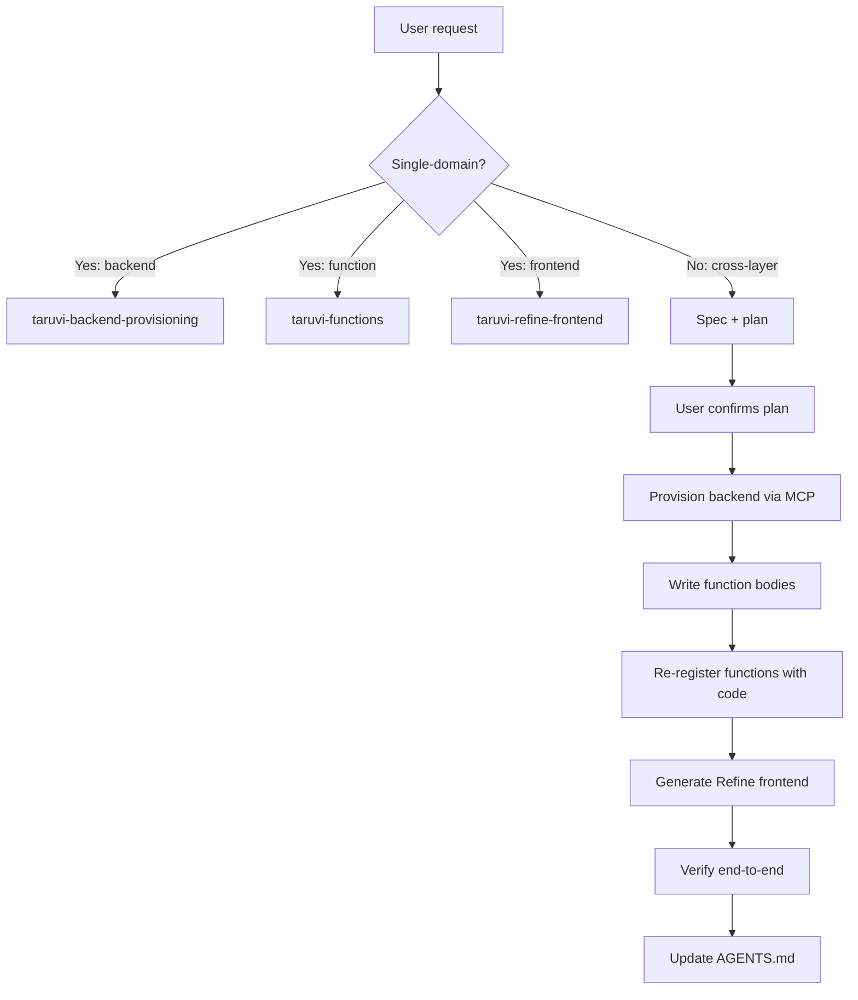

# Taruvi app builder

Orchestrate end-to-end feature development on Taruvi. This skill sets context, routes to specialists, and verifies integration. For the actual provisioning / code-writing / UI-building work, this skill delegates to three specialists.

Default delivery standard: **always build a production-ready, production-scale app.** Not a demo, not an MVP, not a prototype. Every feature must be wired to real backend data, use proper error handling, and be built to handle real-world usage. The user must explicitly ask for a reduced scope if they want anything less.

## ⚠️ Skill Compliance — Non-Negotiable

**These skills are the single source of truth for all Taruvi implementation decisions.** They override existing project code, template patterns, training data, and personal shortcuts.

1. **If a skill prescribes a specific way to implement something, use that way. No exceptions, no shortcuts, no "simpler" alternatives.**
2. **Do not copy patterns from existing project code if they contradict the skills.** Existing code may be outdated, a prototype, or pre-skill.
3. **Do not skip steps to save time.** Every step exists because skipping it causes real bugs or drift.
4. **If you cannot implement a skill requirement**, stop and ask the user instead of silently falling back to an easier approach.
5. **After implementation, verify against the skill's checklist.** If any checklist item fails, fix it before presenting the work as done.

## Core principles

1. **One layer at a time.** Don't interleave MCP provisioning and Refine UI generation in the same step. Provision first, generate second, verify third.
2. **Always plan before executing.** For any non-trivial feature, produce a short plan (entities, tables, policies, functions, pages) and have the user confirm before touching the platform.
3. **Verify against the platform, not memory.** Call MCP tools (`get_datatable_schema`, `manage_policies(action="get")`, etc.) to inspect current state before assuming.
4. **The three specialist skills own the details.** This skill is the orchestrator — it shouldn't duplicate specialist content. When in doubt about how to do something in a specific layer, route to the right specialist.

## The three layers

See [references/architecture-overview.md](references/architecture-overview.md) for the full model.

| Layer | Job | Skill |
|---|---|---|
| **MCP** | Provision backend resources: tables, roles, policies, functions, secrets, buckets | `taruvi-backend-provisioning` |
| **Python SDK** | Write function bodies that run inside Taruvi's function runtime | `taruvi-functions` |
| **Refine providers** | Build the React/Refine frontend that consumes Taruvi | `taruvi-refine-frontend` |

Project-level context (conventions, commands, env) goes in the consuming app's `AGENTS.md` / `CLAUDE.md` — see [references/agents-md-template.md](references/agents-md-template.md) for the template.

## Step-by-Step Instructions

### Step 1 — Detect Project Mode

Identify which mode applies before doing anything:

| Mode | Signals |
|---|---|
| **Greenfield** | No existing Taruvi code, scaffolding from scratch |
| **Existing app** | Project has `@taruvi/sdk`, `.env` with `TARUVI_*` keys, or existing provider/function code |

For existing apps — read the relevant existing files first. Understand what is already built before proposing changes.

### Step 2 — Read Foundation Reference

Open and read `references/architecture-overview.md` before writing any code.

For deploy tasks, ask the user for their deploy target and workflow details.

### Step 2.5 — Identify the Current Package API

Before writing code against Taruvi packages, identify the current non-deprecated API surface in the installed package for this repo.

- Never introduce new usage of deprecated package APIs.
- If old examples, README snippets, or existing code use deprecated providers or hooks, do not copy them into new work.
- If the canonical path is unclear, resolve that before building the feature.
- If the only apparent working path is deprecated, treat that as a provider/docs issue to fix before finalizing the app code.

### Step 2.6 — Set Production-Ready Acceptance Baseline

Unless explicitly scoped down by the user, treat app tasks as production-ready deliverables:

- no hardcoded demo-only arrays for core workflows
- real backend wiring for CRUD/list/detail flows
- backend-driven pagination/sort/filter for list pages
- list-page UX includes visible search and relevant filter controls
- dashboards show live data from real backend queries, automatically calculated from the system's data and kept up to date — never hardcoded or demo values
- error and success paths are surfaced through the app notification provider
- required empty/loading/error states are present for key screens

### Step 3 — Decide: Function or Provider?

Answer this question before routing:

**Does this task touch more than one resource?**
(resources = database tables, storage buckets, users, secrets, analytics)

- **Yes** → a serverless function is required
- **No** → use provider hooks directly

Functions are required when the task involves:
- 2+ resources (multi-resource create/update/delete/mix)
- Backend logic beyond simple CRUD
- Reacting to data or user lifecycle events
- Scheduled / cron background jobs
- Calling external APIs using stored secrets
- Long-running tasks (>30s)
- Public unauthenticated endpoints
- Authorization-gated operations
- Function-to-function pipelines

For everything else — use provider hooks directly, no function needed.

### Step 4 — Route to the Right Module

**You MUST open and read the SKILL.md for every relevant specialist before writing any code.** Do not proceed to implementation until all applicable skills are loaded.

| If the task involves… | You MUST load |
|---|---|
| Backend provisioning (tables, policies, roles, secrets, functions metadata) | `taruvi-backend-provisioning` |
| Python function bodies | `taruvi-functions` |
| Frontend pages, hooks, UI | `taruvi-refine-frontend` |
| Task spans 2+ layers | ALL relevant specialist skills |

**Most app-building tasks require 2+ skills.** For example:
- "Build an employee list page" → `taruvi-refine-frontend` + `taruvi-backend-provisioning`
- "Add file upload to onboarding" → `taruvi-refine-frontend` + `taruvi-backend-provisioning` + `taruvi-functions`
- "Build a dashboard" → `taruvi-refine-frontend` + `taruvi-backend-provisioning`

### Step 5 — Choose Dashboard Query Strategy

If the task includes a dashboard, KPI cards, charts, or summary metrics:

- **Single-table aggregates** → use datatable provider with `useList` + `meta.aggregate`/`groupBy`. This is the default for most dashboards.
- **Multi-table visualizations** → use saved analytics queries via `appDataProvider` + `useCustom` with `meta.kind: "analytics"`. This is required when a dashboard element (card, chart, metric, or any visual) needs to combine data from 2 or more tables to render.
- **Row query + derive in React** is never allowed for summary metrics. Always push aggregation to the server.

**Before writing any dashboard query, check:** does this metric/chart need data from more than one table? For example, "revenue by department" needs orders + departments — that's 2 tables, so use analytics. "Orders by status" only needs the orders table — use datatable aggregate.

### Step 6 — Default List Views to Backend-Driven Queries

For any backend-backed list or table page, the default implementation must be backend-driven:

- backend pagination is required by default
- default list `pageSize` is `10`; recommend exposing `10`, `20`, `50`, and `100` as user-selectable options
- search, filters, and sorting must be server-side by default
- provide visible list controls for search and common filters by default (for example: status, department, date range, active/inactive)
- when the list is rendered with MUI `DataGrid`, default to Refine `useDataGrid`
- client-side filtering or search is only allowed if the user explicitly asks for it or the list is intentionally local-only
- do not fetch one page of backend rows and then apply the primary list filtering logic in React
- if a backend-backed MUI `DataGrid` list is not using `useDataGrid`, document the reason explicitly
- if the current schema or query path cannot support the needed server-side list behavior, fix the backend/query path before calling the feature done
- if search/filter controls are omitted, document the explicit user instruction or concrete reason

### Step 7 — Default Network-Backed Dropdowns to Autocomplete

For any dropdown whose options come from network calls:

- use `Autocomplete` (or equivalent typeahead), not a static `Select`
- query options from the backend with pagination (default option `pageSize` `10`)
- debounce input before sending search requests
- send the current search term as server-side filters, not client-side filtering over previously fetched options
- if the field cannot support server-side search + pagination, treat that as a query/schema gap and fix it before calling the feature done

### Step 8 — Enforce Access-Control Contract

For permission checks in app code:

- use only the published non-deprecated SDK/provider contract with prefixed ACL resource strings
- `useCan`/`CanAccess` resources must be in prefixed form (for example `datatable:employees`, `function:employee-terminate`, `query:hrms-dashboard-summary`)
- do not rely on `params.entityType` for access-control checks
- verify runtime payloads in browser network logs: each `check/resources` `resource.kind` must exactly match the requested `resource` string
- when SDK/provider ACL contract changes, app code must be updated in the same release cycle and versioned accordingly

### Step 9 — Default Bulk Actions to Backend Bulk Operations

For bulk update/delete/status-change flows:

- execute bulk changes through backend bulk operations by default (`updateMany`, `deleteMany`, or a batch serverless function)
- define and show selection scope clearly (selected rows vs filtered result set)
- return and display partial-failure details per record when applicable
- invalidate/refetch affected list and related summary queries after completion

### Step 10 — Use Refine Notification Provider

For user-facing success/error feedback:

- use the app's existing Refine notification integration (`notificationProvider`) by default
- do not introduce custom toast/snackbar systems when Refine notification provider is available

## Rules (always apply)

- **Dashboards** — single-table metrics use datatable `aggregate`/`groupBy`. When a dashboard element needs data from 2 or more tables, use saved analytics queries. Never fetch full row sets into React to derive summary metrics.
- **Functions** — use a serverless function whenever there is any cross-resource side effect, even if it seems minor.
- **Lists** — backend pagination, server-side search/filter/sort, visible search + filter controls, `useDataGrid` for MUI DataGrid. No exceptions unless the user explicitly asks.
- **Dropdowns** — debounced server-side `Autocomplete` with pagination. No static `Select` with one-shot loads.
- **Deprecated providers** — flag `functionsDataProvider`/`analyticsDataProvider` as deprecated; migrate to `appDataProvider + useCustom`.
- **Package API** — use the installed package's current non-deprecated API surface. Do not copy deprecated patterns from existing code.
- **Multi-module tasks** — load all relevant SKILL.md files before starting; don't guess from memory.
- **Unclear project mode** — ask the user: "Is this a new app or does it already have Taruvi providers set up?"

## Greenfield scaffold workflow

For a new Taruvi app from scratch:

1. **Interview**. Clarify: what does the app do? What entities? Auth model (email/pass, OAuth)? Who are the roles?

2. **Tenant setup** (if fresh tenant). Usually handled outside this workflow by Taruvi admin; if not, use `create_tenant` via Django management command (document in the app's README).

3. **Refine app scaffold**. Create a new Refine project:
   ```bash
   npm create refine-app@latest my-app -- --template=vite-antd --template-features=typescript,tailwind
   ```
   Install Taruvi packages:
   ```bash
   cd my-app
   npm install @taruvi/sdk @taruvi/refine-providers
   ```

4. **Wire providers**. Replace `App.tsx` provider wiring with the Taruvi providers — see [references/feature-workflow-examples.md](references/feature-workflow-examples.md) for a full snippet. Activate `taruvi-refine-frontend` for details.

5. **Provision the schema**. Activate `taruvi-backend-provisioning`. Define entities as a Frictionless Data Package, create the tables.

6. **Provision roles + policies**. Still in `taruvi-backend-provisioning`. Create roles, Cerbos policies, initial role assignments.

7. **Write functions (if needed)**. Register function metadata via `taruvi-backend-provisioning` (`manage_function`), then activate `taruvi-functions` to write the bodies.

8. **Generate Refine pages**. Activate `taruvi-refine-frontend`. Generate list / show / edit / create pages for each resource, wire access control.

9. **Configure the app's AGENTS.md**. Emit the template from [references/agents-md-template.md](references/agents-md-template.md) with the specifics for this app.

10. **Verify end-to-end**. Run the Refine dev server, walk through the primary user flow, confirm auth + CRUD + policy enforcement.

See [references/feature-workflow-examples.md](references/feature-workflow-examples.md) for worked examples.

## Feature-add workflow (existing app)

For adding a feature to an existing Taruvi app:

1. **Spec**. Describe the feature in one paragraph. Identify: new entities, new policies, new functions, new pages.

2. **Plan** — emit this structure for user review:
   ```
   Feature: <name>

   Backend (MCP):
   - Datatables: <new or modified>
   - Policies: <new rules>
   - Roles: <if new>
   - Functions (metadata): <slug + mode>
   - Secrets: <if new>

   Functions (bodies):
   - <slug>: <one-line description>

   Frontend (Refine):
   - Resources to add to Refine `resources[]`: <list>
   - Pages: list / show / edit / create for each
   - Access control: <rules>

   Verification:
   - <what the user tests>
   ```
   Get user confirmation before executing.

3. **Provision backend** — delegate to `taruvi-backend-provisioning`. Call MCP tools in order: schema → roles → policies → function metadata → secrets.

4. **Write function bodies (if any)** — delegate to `taruvi-functions`. After writing, re-register via `manage_function(action="create_update", code=<body>)` in the backend-provisioning skill.

5. **Generate frontend** — delegate to `taruvi-refine-frontend`. Add Refine resources, generate CRUD pages, wire `useCan` and `meta.allowedActions`.

6. **Verify**. Run the app locally. Confirm: tables are reachable, policies gate correctly, functions execute, Refine pages render.

## Integration gotchas

See [references/integration-pitfalls.md](references/integration-pitfalls.md) for the full list. Top hits:

1. **Create policies before first write.** If a policy is missing, the first insert to the table 403s. Policy → table materialization → first insert.
2. **`meta.idColumnName` in Refine must match the Frictionless `primaryKey`.** Non-`id` PKs need `idColumnName` on every hook. Or alias via `meta.tableName` with an `id` column aliased in an analytics view.
3. **Function metadata and body live in different surfaces.** Use `manage_function` (MCP) to register; write the body in `taruvi-functions` context; re-call `manage_function(action="create_update", code=<body>)` to deploy.
4. **Async functions return a task id, not a result.** Refine's `useCustom` with `meta.kind: "function"` expects a sync response. Either keep the function sync, or poll for the result client-side.
5. **Env vars are critical.** The consuming app needs `TARUVI_API_URL`, `TARUVI_API_KEY`, `TARUVI_APP_SLUG` (front-end: `REACT_APP_*` or `VITE_*` prefix). See [references/env-setup.md](references/env-setup.md).
6. **Tenant schema matters in dev.** Local dev often means pointing at a specific tenant subdomain or passing an `X-Tenant` header. Document the dev setup in the app's AGENTS.md.
7. **JWT expiry cascades.** If a Refine user's JWT expires, they get 401 → `authProvider.onError` → forced logout. No silent refresh in the default flow. Long-lived sessions need refresh-token handling (outside default).

## Verification checklist

After a feature lands, confirm:

- [ ] Datatable exists and has the expected schema (`get_datatable_schema`).
- [ ] Policy exists and is enabled (`manage_policies(action="get")`).
- [ ] Role assignments are correct for a representative test user.
- [ ] Function (if any) executes without error (`execute_function`). Check the response format — frontend must adapt the backend response format.
- [ ] Analytics query (if any) executes without error (`execute_query`). Check column names — frontend must adapt the backend response format.
- [ ] If access control is configured: ALWAYS create test users for each role before marking the task complete. Do not skip this unless the user explicitly says no user creation.
- [ ] Test user naming must be deterministic: `qa_<role_slug>_<YYYYMMDD>` (example: `qa_inventory_manager_20260422`).
- [ ] Test user passwords must be strong and unique (12+ chars with upper/lower/digit/symbol), then reported with usernames in the final output.
- [ ] Include cleanup guidance in the final output: either deactivate/delete created `qa_*` users after validation or rotate their passwords.
- [ ] Refine resources are in `resources[]` and map correctly.
- [ ] List page renders with data, filters work, pagination works.
- [ ] Any `meta.populate` usage only references declared table relationships (no plain UUID field names unless explicitly declared as relationships).
- [ ] Edit page saves, Cerbos allows/denies as expected.
- [ ] `useCan` gates the right UI elements.
- [ ] Storage uploads/downloads work (if file-backed).

## Workflow diagram



## When you get stuck

- Architecture overview: [references/architecture-overview.md](references/architecture-overview.md)
- Feature workflow examples (3 worked): [references/feature-workflow-examples.md](references/feature-workflow-examples.md)
- AGENTS.md template for consuming apps: [references/agents-md-template.md](references/agents-md-template.md)
- Env var setup: [references/env-setup.md](references/env-setup.md)
- Integration pitfalls: [references/integration-pitfalls.md](references/integration-pitfalls.md)
- Deployment workflow (Frontend Workers): [references/deployment.md](references/deployment.md)
- For specialist detail, load the matching specialist skill's `SKILL.md` and relevant reference files.
